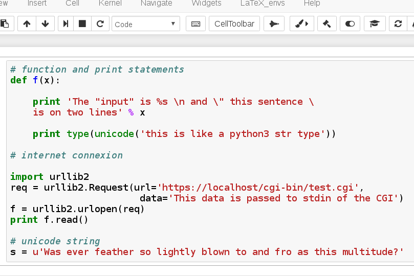

A 2to3 converter
================

This nbextension converts python2 code in notebook code cells to python3 code.

Under the hood, it uses a call to the current notebook kernel to reformat the
code.
The conversion run by the kernel uses Python's standard-library [lib2to3]
module.

The nbextension provides

- a toolbar button (configurable to be added or not)

- a keyboard shortcut for reformatting the current code-cell (default shortcut
  is `Ctrl-M`, can also be configured not to add the keyboard shortcut).

- a keyboard shortcut for reformatting the whole notebook (default shortcut
  is `Ctrl-Shift-M`, can also be configured not to add the keyboard shortcut).

Syntax needs to be correct, but the nbextension may be able to point out basic
syntax errors.

Options
-------

All options are provided by the [KerneExecOnCells library] - see the
[internals] section below for details.
There are a few nbextension-wide options, configurable using the
[jupyter_nbextensions_configurator] or by editing the `notebook` section config
file directly.
The options are as follows:

- `2to3.add_toolbar_button`:
  Whether to add a toolbar button to transform the selected cell(s).
  Defaults to `true`.

- `2to3.button_icon`:
  A font-awesome class defining the icon used for the toolbar button and
  actions. See [fontawesome] for available icon classes.
  Defaults to `fa-legal`.

- `2to3.button_label`:
  Toolbar button label text. Also used in the actions' help text.
  Defaults to `Convert Python 2 to 3`.

- `2to3.register_hotkey`:
  Whether to register hotkeys to transform the selected cell(s)/whole notebook.
  Defaults to `true`.

- `2to3.hotkeys.process_all`:
  Hotkey to use to transform all the code cells in the notebook.
  Defaults to `Ctrl-Shift-L`.

- `2to3.hotkeys.process_selected`:
  Hotkey to use to transform the selected cell(s).
  Defaults to `Ctrl-L`.

- `2to3.show_alerts_for_errors`:
  Whether to show alerts for errors in the kernel calls.
  Defaults to `true`.

- `2to3.kernel_config_map_json`:
  The value of this key is a string which can be parsed into a json object
  giving the config for each kernel language.

  The following give the per-kernel options of the parsed json, using the
  language key `python `:

  * `2to3.kernel_config_map_json.python.library`:
    String to execute in the kernel in order to load any necessary kernel
    libraries.

  * `2to3.kernel_config_map_json.python.replacements_json_to_kernel`:
    a list of pairs of strings, used as arguments to javascript's
    `String.replace(from, to)` to translate from a json string into a valid
    representation of the same string in the kernel language. Since json
    strings are particularly simple, this can often (as with the python
    language) be left as the default, an empty list.

  * `2to3.kernel_config_map_json.python.prefix` and
    `2to3.kernel_config_map_json.python.postfix`:
    Strings added as bookends to the kernel string (translated from the json
    string using the replacements above) to make up the kernel prettifier call
    kernel's prettifier libraries.

  * `2to3.kernel_config_map_json.python.trim_formatted_text`:
    Whether to trim whitespace from the transformed cell text. Since jupyter
    cells don't usually have leading or trailing whitespace, the default
    behaviour is to trim the transformed text, in order to prevent the
    transform adding extra newlines at the end (a common behaviour for source
    files, where having a trailing newline is often considered good practice).

Internals
---------

Under the hood, this nbextension uses the [KerneExecOnCells library], a shared
library for creating Jupyter nbextensions which transform code cell text using
calls to the active kernel.

See the [shared README] for the internal model used by the nbextension.

History
-------

The project was forked by [@EWouters] from [@jfbercher]'s [code_prettify],
retaining most of the code.

It has since been altered to use the [KerneExecOnCells library], a shared
library for creating Jupyter nbextensions which transform code cell text using
calls to the active kernel.

The 2to3 conversion's kernel-side python code is based on [2to3_nb.py] by
[@takluyver] and [@fperez].

It could be extended to use the [futurize] functions so it can convert both
ways.

[2to3_nb.py]: https://gist.github.com/takluyver/c8839593c615bb2f6e80
[@EWouters]: https://github.com/EWouters
[@fperez]: https://github.com/fperez
[@jfbercher]: https://github.com/jfbercher
[@takluyver]: https://github.com/takluyver
[code_prettify]: https://github.com/jfbercher/code_prettify
[futurize]: http://python-future.org/automatic_conversion.html
[fontawesome]: https://fontawesome.com/icons
[internals]: #Internals
[jupyter_nbextensions_configurator]: https://github.com/Jupyter-contrib/jupyter_nbextensions_configurator
[KerneExecOnCells library]: README.md
[lib2to3]: https://docs.python.org/3/library/2to3.html#module-lib2to3
[shared README]: README.md
