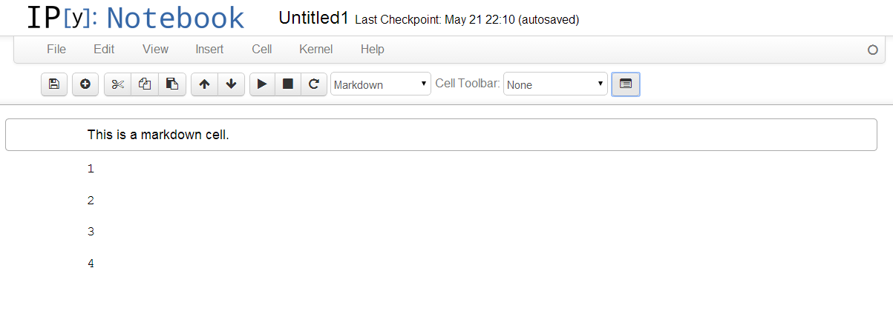

Hide all Input
==============
This extension allows hiding all codecells of a notebook. This can be achieved by clicking on the button toolbar:

Typically, all codecells are shown with their corresponding output:

Clicking on the "Toggle codecell display" toolbar button hides all codecells:

Internals
---------

The codecell hiding state is stored in the metadata `IPython.notebook.metadata.hide_input`.
If it is set to `true`, all codecells will be hidden on reload.

The `nbextensions.tpl` template is provided in the
`jupyter_contrib_nbextensions.nbconvert_support` templates directory (see the
docs mentioned above for how to find it)

To use, add the template to your `nbconvert` call:

    jupyter nbconvert --template=nbextensions --to=html my_notebook.ipynb

The nbextensions template will respect the `nb.metadata.hide_input` flag, and
filter the cell's output prompt (the bit that looks like `Out[27]:`).
The filter is only used for html output, not for PDF or LaTeX output.

If you want to _keep_ the cell output prompt, you will have to remove the lines

    
    
    
        {{ super() }}
    
    

in the `nbextensions.tpl` file.
 